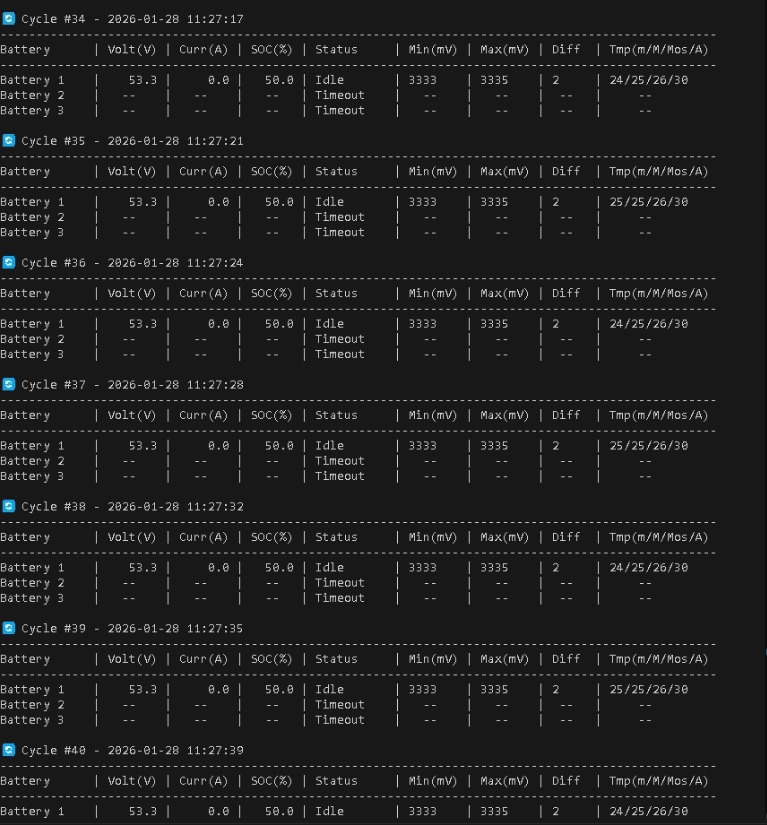
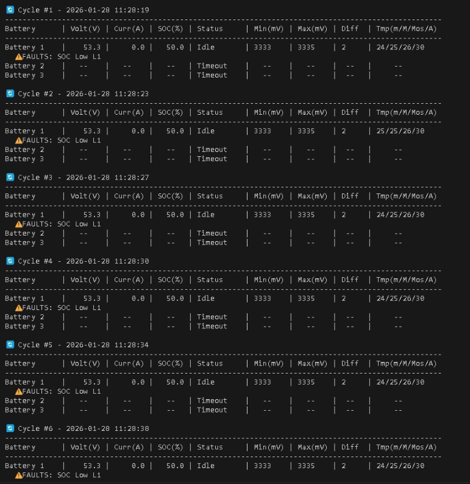

# Polling Daly BMS Modbus Register Addresses

Python implementation for polling Daly BMS data using Modbus RTU protocol over RS485/UART.

## Screenshots

- Cycle Battery Data Example



- Fault Alarm Example



## Technology Stack

- **Python:** >3.9
- **Libraries:** `pyserial`

## Installation

1. **Clone the repository:**

    ```bash
    git clone https://github.com/Sundaya-Development-Team/python-daly-16S.git
    cd python-daly-16S
    ```

2. **Install dependencies:**
    ```bash
    pip install -r requirements.txt
    ```

## Configuration

Before running, check the configuration in `new_main.py`:

- **PORT:** Set your serial port (e.g., `'COM9'` on Windows or `'/dev/ttyUSB0'` on Linux).
- **BAUDRATE:** Default is `115200`.
- **BATTERIES:** Configure your battery IDs in the `BATTERIES` list.

you can add or remove battery ID in the list.


## Usage

### Using VS Code / Cursor / Antigravity / your favorite IDE

1. Open the project folder in your IDE.
2. Right-click on `new_main.py` in the sidebar.
3. Select **Open in Integrated Terminal**.
4. Run the command:
    ```bash
    python new_main.py
    ```

## File Structure

- `new_main.py`: Main execution script for polling multiple batteries (Main Program).
- `main.py`: Original polling script (Legacy version).
- `address.py`: Modbus register address definitions and fault codes.
- `requirements.txt`: Python dependency list.

## Authors

Developed by Sundaya RnD Team
